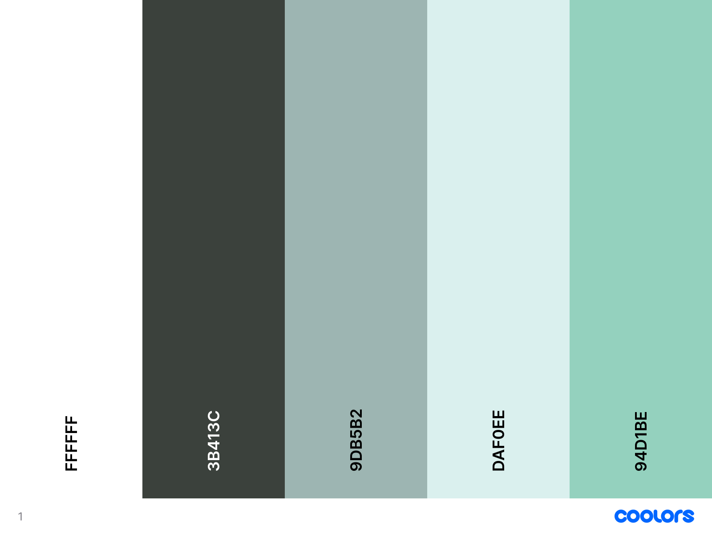
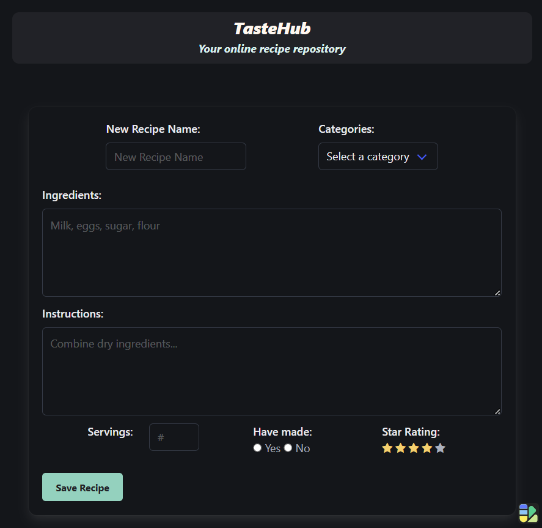

# Project One 
 
## TasteHub

## Description
TasteHub is an online repository of recipes by users that can be sorted by meal categories 
and cookbooks can be joined by other users for easy recipe sharing. Users will also be able to rate their recipes from 1 to 5 stars for future reference. 
 
## Visuals
color palette image 

screenshot of TasteHub deployed website 
 

## Features
Saving recipes: users can input and save their recipes in local storage
Recipe Rating: users will be able to rate recipes from 1 to 5 stars and attach other attributes to the recipe, such as servings size, category, and whether or not the recipe has been made or not.

## Roadmap
FUTURE DEV:
Cookbook Sharing: users can join others cookbooks to share their recipes including allowing users to utilize the site as a social media platform, permitting users to join cookbooks and share their favorite recipes.
Allow users to backup their recipe repository to ensure they still have their favorite recipes in the event of their local storage refreshing
Sorting: users can sort their recipes by meal categories, certain attributes, category, ingredients, etc.
Recipe Multiplier: allows you to adjust the recipe based on how many servings are desired
Add modals to the saved recipes to bring up the recipe information with the option to make edits.
Add more accessibility features for user convenience such as:
  - Add a text to speech function
  - Add a light mode which responsibly changes background colors and text for readability

## Authors and Acknowledgment
Annie-Rose Brinkerhoff, Ellen Rogers, Emily Holt, Grace Fernandez, Zachary Haskell

## Project status
in development

